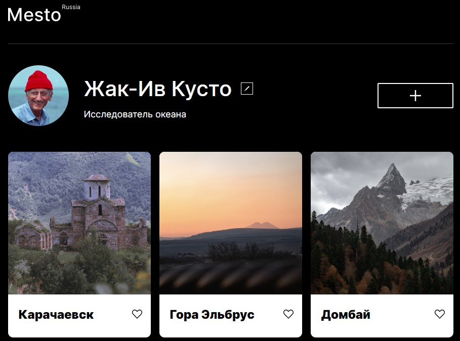

# Проект 4: Место

### Обзор

* [Ссылка на проект в GitPage](https://den-april-20.github.io/mesto)

Использовал адаптивную верстку для удобного пользования как на ПК, так и на мобильных устройствах.

Закрепил html и css. В частности гриды, флексы, БЭМ, псевдоклассы.

Начал изучать JS. Использовал переменные и функции. Работал с DOM.

**Figma**

* [Ссылка на макет в Figma](https://www.figma.com/file/StZjf8HnoeLdiXS7dYrLAh/JavaScript.-Sprint-4)

Работа будет обновлена до 13.12, т.к. следующая проектная работа будет продолжением этой.
